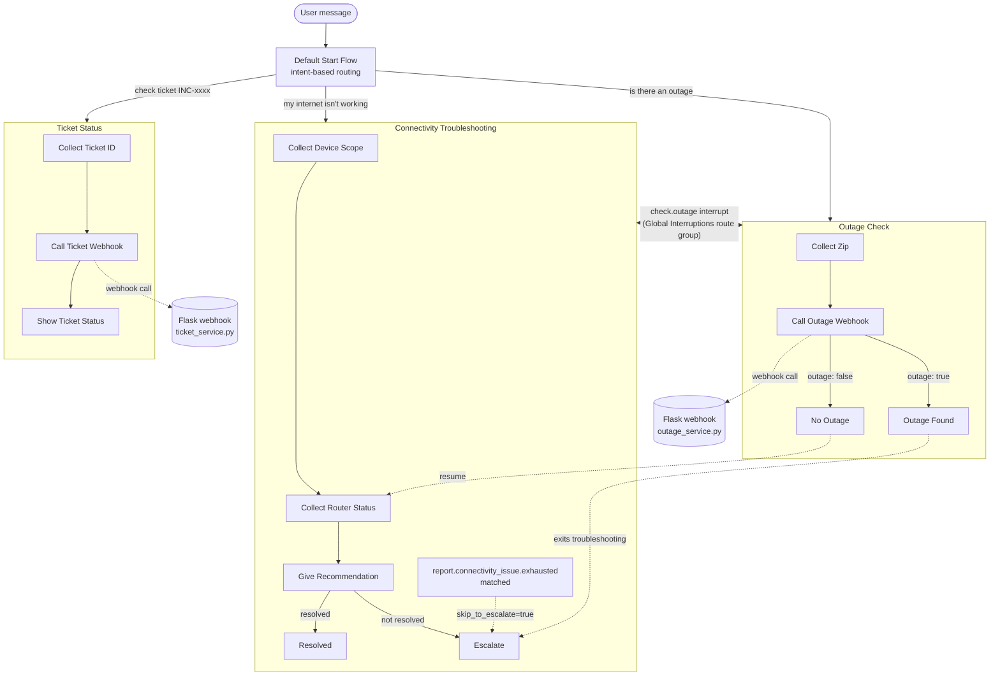

# ISP Customer Support Assistant — Dialogflow CX

Take-home build for a Dialogflow CX Senior Engineer assignment: a support
assistant for an ISP that handles connectivity troubleshooting, outage
lookups, and ticket status checks. Two of the three talk to a webhook
backend; troubleshooting is pure flow logic. Built to be small enough to
actually finish, not a demo of every CX feature that exists.

## What's in here
## Architecture diagram



Interruptions and the composite-input skip are shown as dotted lines since
they're not the normal happy-path routes — they're the two places the
agent deviates from the straight-line journey. Exact pages, conditions,
and parameter names are all in the exported agent zip if you want the
precise version instead of this simplified view.

## Running the webhook

```bash
cd webhook
python -m venv venv && source venv/bin/activate
pip install -r requirements.txt
cp .env.example .env      # only needed if you want the shared-secret check on
python app.py
```

It listens on `http://localhost:8080/webhook`. Health check is
`curl http://localhost:8080/healthz`, should give you `{"status": "ok"}`.

Dialogflow CX can't call `localhost` directly, so during development I
tunnel it out with ngrok:

```bash
ngrok http 8080
```

Take whatever `https://...ngrok-free.app/webhook` it gives you and put it
in as the webhook URI — either in the CX console under Manage → Webhooks,
or in `WEBHOOK_URL` inside `build_agent.py` if you're building the agent
from scratch.

## Getting the agent into your own project

Two ways to do this, pick whichever's easier:

**Import the export directly.** `exported_agent_ISP Customer Support
Assistant.zip` in the repo root is a JSON Package export of the actual
agent, taken after everything below was finished and tested. In the CX
console: Agent selector → Import → point it at the zip. Gets you the
exact final state with zero setup.

**Or run the build script.** `dialogflow_cx_agent/build_agent.py` creates
the agent from scratch through the Python client — all four flows, the
entities, the intents, the webhook resource. Set `PROJECT_ID` and
`WEBHOOK_URL` at the top of the file, then:

```bash
cd dialogflow_cx_agent
pip install -r requirements.txt
gcloud auth application-default login
python build_agent.py
```

I went with a script instead of hand-building in the console mainly
because it's the only version of "the agent" that diffs cleanly in git —
the export zip is basically a binary blob as far as version control
cares. The script also doubles as the answer to the deployment question
further down: it's the thing you'd actually run in a pipeline.

One thing worth knowing: it isn't idempotent. Run it twice against the
same project and you'll get duplicate flows. Fine for a take-home, not
fine for anything real — noted again under limitations.

## Env vars

Webhook side (`webhook/.env`):

- `PORT` — defaults to 8080, only set it if you need something else
- `LOG_LEVEL` — standard Python logging levels
- `WEBHOOK_SHARED_SECRET` — if you set this, `/webhook` starts requiring
  an `X-Webhook-Secret` header matching it. Leave unset and it's open,
  which is fine for local dev, not for anything past that.

Agent build script — these are just constants at the top of
`build_agent.py` rather than env vars, since you'd only ever run this
script once per environment: `PROJECT_ID`, `LOCATION`, `WEBHOOK_URL`,
`WEBHOOK_SHARED_SECRET`.

## Tests

```bash
cd webhook
python -m pytest tests/ -v
```

22 tests. Outage service gets the happy path, an unknown zip, an invalid
zip, and the three simulated failure modes (timeout, 5xx, malformed
response). Ticket service gets happy path, not-found, invalid ticket ID
format, simulated 5xx. The Flask layer itself is tested end to end —
right session parameters set, right HTTP status codes back, right
fallback text when something breaks downstream.

## Why it's structured this way

Four flows: a thin Default Start Flow that does nothing but route on
intent, then one flow each for Troubleshooting, Outage Check, and Ticket
Status. I kept these separate rather than cramming everything into pages
under one flow because each of the three journeys has its own parameters
and its own failure modes — mixing them would mean every page's routing
logic has to account for state that belongs to a completely different
conversation. Splitting them means I can look at the Outage Check flow in
isolation and know everything relevant to it is right there.

Session parameters only ever hold what the current conversation needs —
device scope, router status, the ticket ID being looked up. Nothing that
should live in a database lives in a session param, and nothing sensitive
sticks around longer than the turn needs it.

Webhook side, there's one Flask app with two tags (`check-outage`,
`get-ticket-status`). All the Dialogflow-shaped request/response parsing
stays in `app.py`; the actual logic — hitting the "backend," deciding
what a response means — lives in `services/`, where it can be unit
tested without touching Dialogflow's webhook format at all.

## Interruption handling

There's a route group called "Global Interruptions" attached at the
Troubleshooting flow level, not on any individual page, so `check.outage`
can fire no matter where you are inside that flow — mid router-status
question, looking at a recommendation, wherever. Attaching it per-page
would mean re-adding it every time I added a page, and I'd inevitably
forget one.

When it fires, Troubleshooting's own session params don't get touched —
CX keeps session parameters around across flows in the same session
automatically, so nothing gets lost just by hopping over to Outage Check.
No Outage sends the user back into Troubleshooting where they left off;
Outage Found ends the troubleshooting attempt outright, since there's not
much point continuing to ask about router lights if there's a confirmed
outage in the area. That's the "resume or exit, whichever makes sense"
behavior the assignment asked for.

## Composite-input handling (the "cognitive" requirement)

This came in as a follow-up from the client after the original build was
basically done. The ask: if someone says something like

> "My internet is not working. I've already restarted the modem and my
> laptop, and tried both LAN and Wi-Fi, still broken."

— i.e. one message that already answers both the device-scope and
router-status questions — the agent shouldn't make them repeat all that.
It should skip straight to escalation and acknowledge what they already
tried.

I didn't want to reach for anything generative here — partly because
it's genuinely out of scope for a standard CX agent, and partly because
I'd rather ship something deterministic I can actually demo working the
same way twice. So it's built as:

- a new intent, `report.connectivity_issue.exhausted`, trained on
  phrasing that describes multiple completed troubleshooting steps in
  one message
- matching it sets a session parameter, `skip_to_escalate = true`
- at the top of Troubleshooting's entry routing — before the normal
  catch-all into Collect Device Scope — there's a route that checks that
  parameter and sends things straight to Escalate if it's set
- Escalate's message is conditional on that same parameter: if it's set,
  it acknowledges the steps already taken instead of the generic
  escalation line

A plain "my internet isn't working" doesn't match that intent, so it
falls through to the normal catch-all and runs the full Q&A exactly like
before — this only kicks in when the composite pattern is actually
there.

Worth saying plainly: this is pattern matching against training phrases,
not the model reasoning about the conversation. That's a real
limitation — it'll handle the documented example and things phrased
similarly, but won't generalize to every possible way someone could
describe having already tried everything. Trade-off I made on purpose,
and I'd rather be upfront about it than have it look like more than it
is.

## Technical design questions

**Why this flow/page structure?**
Mainly explained above — one flow per journey keeps each conversation's
state and routing self-contained, and the thin start flow means adding a
fourth or fifth journey later doesn't mean touching the existing three.

**What goes in session parameters vs. backend storage?**
Session params: whatever the current turn needs to make its next
decision — device scope, router status, the ticket ID somebody just
gave. Backend storage: anything that needs to outlive the conversation
or be looked up independently of it — actual outage records, actual
ticket data, anything that counts as a customer's real account
information. Session state is disposable by design; if the session ends,
nothing of record should be lost with it.

**How would this scale to 100+ journeys?**
Honestly, I wouldn't keep it as one growing pile of flows in one agent —
I'd split by domain (billing, connectivity, account, etc.) potentially
across multiple agents or at least clearly namespaced flow groups, with a
routing layer in front that classifies broad intent first and only then
hands off to the specific flow. Shared logic (auth checks, common
escalation, logging) would need to live somewhere flows can call into
rather than getting copy-pasted across 100 flows.

**How would you version and deploy this safely?**
Treat `build_agent.py` (or an equivalent declarative definition) as the
source of truth, not the console. Changes go through a normal PR/review
process, get applied to a staging agent first, get tested there, then
promoted. CX supports versions/environments natively — I'd use a
"staging" environment for anything unverified and only point production
traffic at a version once it's been through real testing, with an easy
rollback to the prior version if something regresses.

**No-match rate suddenly spikes after a release — how do you
investigate?**
First thing I'd check is whether it's every intent or concentrated on a
few — that alone tells you if it's a broad regression (webhook down,
routing broken) or something narrower (one flow's training phrases got
touched). Then compare timing against the release itself and against any
NLU model retraining that might have happened independently. If it's
concentrated, pull actual transcripts from around the spike and see what
users are actually typing that isn't matching — usually it's either a
wording pattern nobody trained for, or a route that got reordered or
removed in the release.

## Production considerations

**What I'd monitor:**

- **Webhook latency and failures** — p50/p95/p99 latency and error rate
  per tag (`check-outage`, `get-ticket-status`), alerting on error-rate
  spikes or p95 getting close to the CX webhook timeout.
- **No-match rate** — per intent and per page, since a spike almost
  always means a training-phrase gap or a wording change that shipped
  recently.
- **Conversation abandonment** — sessions that end outside a "resolved"
  or "escalated" terminal page, bucketed by which flow/page they dropped
  at, so it's obvious where people are actually giving up.
- **Task completion rate** — the percentage of sessions that reach a
  defined success page: Resolved, Outage Found and acknowledged, or
  Ticket status delivered.
- **Escalation rate** — how often Troubleshooting ends at Escalate over
  time. A sustained rise there could mean a real service issue, or it
  could mean the composite-input logic above is over-firing — worth
  distinguishing between the two.

**Credentials and secrets:** the webhook's shared secret and any
downstream API keys belong in a secret manager (GCP Secret Manager or
equivalent), injected as environment variables at deploy time. Never
committed to the repo, never written to logs.

**Sensitive customer information:** don't collect more than the active
journey actually needs — a ZIP code, a ticket ID, nothing beyond that.
Raw parameter values shouldn't be logged at INFO level in production;
hashed or truncated identifiers are enough for most debugging, and full
detail should only show up at DEBUG in non-prod environments.

**Webhook authentication:** the shared-secret header this repo uses is a
floor, not a real production answer. For an actual deployment I'd lean
on Dialogflow CX's built-in service-account-based webhook authentication
(OIDC token), fronted by IAM on Cloud Run or Cloud Functions, so there's
no static secret sitting around that could leak in the first place.

**Logging of customer data:** structured logs with a request ID
attached, no raw PII in the log lines themselves — ZIP codes are
borderline-sensitive at any real scale and I'd treat them like PII — and
a retention/rotation policy that matches whatever data-privacy rules
actually apply to the ISP's customer base.

## Known limitations

- The "backend" is in-memory fake data plus explicit failure flags
  (`simulate="timeout"/"5xx"/"malformed"`), not a real ISP system —
  enough to prove the error-handling paths work without standing up
  real infrastructure.
- `build_agent.py` isn't idempotent. Re-run it against an agent that
  already exists and you'll get duplicates, not an update.
- A couple of pages use CX's conditional-response syntax inline rather
  than as separate per-value response blocks, mostly for brevity — in a
  real console build I'd split those out properly.
- Nothing here is deployed to Cloud Run or anywhere else — running the
  webhook locally via ngrok is explicitly allowed by the assignment, so
  that's what this is.
- The composite-input detection is intent/pattern-based, so it's solid
  for the documented example and close variants, but it's not going to
  catch every conceivable phrasing of "I already tried everything" —
  that would need either a lot more training phrases over time or a
  genuinely different approach.

## Demo

Video: **[add link here]**

Covers the composite-input example above skipping straight to Escalate,
a simulated backend timeout with graceful recovery, and quick passes
through a normal resolved troubleshooting run, an outage check, and one
interruption mid-flow.
