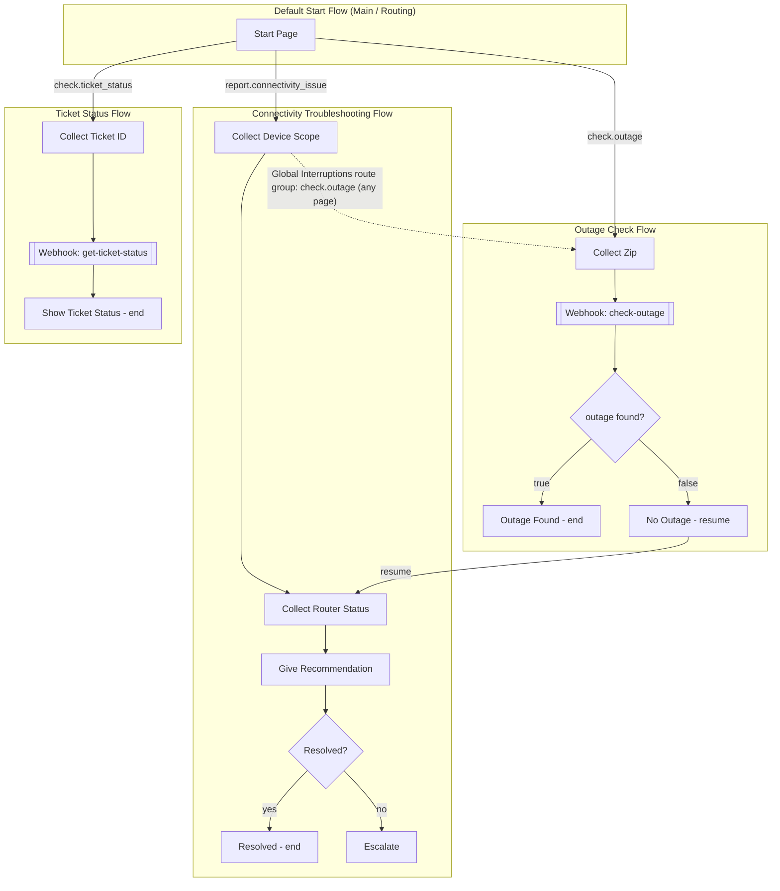

# Architecture

## Flow/Page diagram

## Why this Flow/Page structure (Question 1 answer, expanded)

Each customer journey (troubleshooting, outage check, ticket status) gets
its **own flow**, with a minimal Default Start Flow doing nothing but
intent-based routing into the right one. Reasons:

1. **Separation of concerns.** Each flow's pages, parameters, and
   fulfillment logic are scoped to one job. A reviewer can open the
   Troubleshooting flow and understand the entire troubleshooting journey
   without any outage or ticket logic in the way.
2. **Independent iteration.** Troubleshooting steps will change far more
   often than ticket lookup ever will (as new device types, ISPs, or
   equipment are added) — flow-per-journey means those changes are
   isolated and don't risk regressing the other two journeys.
3. **Reusable interruption surface.** Attaching the outage-check
   interruption as a **route group at the flow level** means it's
   reachable from every page inside Troubleshooting without repeating the
   same route on each page individually.
4. **Scales toward more journeys** (see Question 3) — adding a fourth
   journey means adding a fourth flow and one routing intent in the start
   flow, not touching the internals of the existing three.

## Page-level detail

### Default Start Flow
- **Start Page**: routes on `report.connectivity_issue`,
  `check.outage`, `check.ticket_status` intents to the matching flow.

### Connectivity Troubleshooting Flow
- **Collect Device Scope** → asks single vs. multiple devices affected.
- **Collect Router Status** → asks about router lights.
- **Give Recommendation** → conditional message branching on
  `router_status`; asks if resolved.
- **Resolved** (end) / **Escalate** (end) — reached via `confirm.yes` /
  `confirm.no` intents on the Recommendation page.
- **Global Interruptions** route group (flow-level): `check.outage`
  intent → Outage Check flow, from any page in this flow.

### Outage Check Flow
- **Collect Zip** → form parameter `zip_code` (built-in `@sys.zip-code`).
- **Call Outage Webhook** → webhook fulfillment, tag `check-outage`.
- **Outage Found** (end) / **No Outage** → branches on
  `$session.params.outage_found`; failure statuses loop back to
  **Collect Zip** for a retry.
- **No Outage** transitions back into Troubleshooting (resume); **Outage
  Found** ends the session there instead, since troubleshooting steps are
  moot once a confirmed outage explains the issue.

### Ticket Status Flow
- **Collect Ticket ID** → form parameter `ticket_id` (custom regexp
  entity type matching `INC-?\d{4,8}`).
- **Call Ticket Webhook** → webhook fulfillment, tag `get-ticket-status`.
- **Show Ticket Status** (end) — failure statuses loop back to
  **Collect Ticket ID**.
